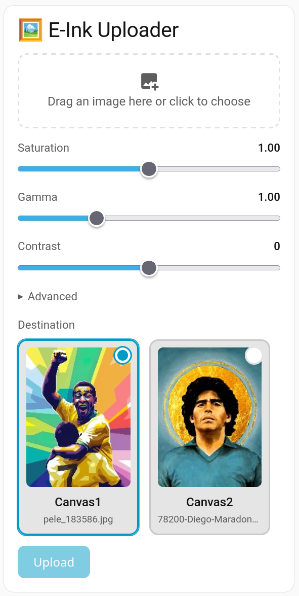

# BLOOMIN8 Canvas Uploader

[](https://github.com/hacs/integration)
[](https://github.com/teras/bloomin8-canvas-card/releases)
[](LICENSE)

A Lovelace card for **BLOOMIN8 E-Ink Canvas** panels that lets you pick an image,
process it in the browser, preview the result, and push it to a panel — without
leaving your dashboard.

All image processing happens **client-side** on a `<canvas>`; the only thing sent
to Home Assistant is the finished JPEG.

<p align="center">
  
</p>

## Features

- **Drag & drop / click** to pick a local image.
- **Crop-to-content** — trims uniform borders (like ImageMagick `-trim`), something
  the integration's own scaling does not do.
- **Orientation-aware** — optional auto-rotate of landscape sources to fit portrait
  panels, then center cover-crop to the panel's aspect ratio.
- **Saturation / Gamma / Contrast** sliders — pull the colours as hard as your
  e-ink palette can take, with **live WYSIWYG preview**.
- **Single-select destination** with a per-panel thumbnail of what each panel is
  currently showing.
- **Battery-friendly previews** — the device is **never** polled for previews.
  Thumbnails are cached in `localStorage` and updated on upload (from the image you
  just sent) or via an explicit **Refresh** button.
- **Theme-aware** — inherits Home Assistant theme variables (light/dark, custom
  header fonts, accent colours).
- Pure **vanilla JavaScript**, no build step, single file.

## Requirements

- Home Assistant with the [**BLOOMIN8 E-Ink Canvas** integration](https://github.com/ARPOBOT-BLOOMIN8/eink_canvas_home_assistant_component)
  installed and at least one panel configured. The card calls its
  `bloomin8_eink_canvas.upload_image_data` service.

## Installation

### HACS (recommended)

1. In HACS, open the three-dot menu → **Custom repositories**.
2. Add `https://github.com/teras/bloomin8-canvas-card` with category **Dashboard**.
3. Install **BLOOMIN8 Canvas Uploader** and reload your browser.

### Manual

1. Copy `dist/bloomin8-canvas-card.js` to `<config>/www/bloomin8-canvas-card.js`.
2. Add it as a dashboard resource (Settings → Dashboards → ⋮ → Resources):
   - URL: `/local/bloomin8-canvas-card.js`
   - Type: **JavaScript Module**
3. Hard-refresh the browser.

## Usage

Add the card to a dashboard:

```yaml
type: custom:bloomin8-canvas-card
title: E-Ink Uploader
panels:
  - entity: media_player.canvas1_media_player
    name: Canvas1
  - entity: media_player.canvas2_media_player
    name: Canvas2
```

### Options

| Option   | Type     | Required | Default          | Description |
|----------|----------|----------|------------------|-------------|
| `type`   | string   | yes      | —                | `custom:bloomin8-canvas-card` |
| `title`  | string   | no       | `E-Ink Uploader` | Card header. |
| `language` | string | no       | *auto*           | Force UI language (`en`, `el`). Defaults to `hass.language`. |
| `panels` | list     | yes      | —                | One or more destination panels (see below). |

Each entry in `panels`:

| Field               | Type   | Required | Default | Description |
|---------------------|--------|----------|---------|-------------|
| `entity`            | string | yes      | —       | The panel's `media_player` entity. |
| `name`              | string | no       | entity  | Label shown on the destination tile. |
| `resolution_entity` | string | no       | *auto*  | The `sensor.*_screen_resolution` entity for this panel. Auto-derived from the `media_player` entity id when omitted; falls back to 1200×1600. |

The destination is single-select — pick one panel per upload. Any number of panels
is supported; the tiles wrap into a responsive grid.

## How previews work (and why they save battery)

E-ink panels sleep to save power, and BLE auto-wake means a naive image fetch can
wake the device. To avoid that, this card **does not** fetch the live image on
render. Instead:

- Thumbnails are cached in `localStorage` and shown instantly on load.
- After an upload, the destination thumbnail is regenerated locally from the exact
  bytes that were just sent — no device round-trip.
- The **Refresh preview** button (under *Advanced*) is the only action that reads
  the current image from the device.

## Development

Single file, no toolchain. Edit `dist/bloomin8-canvas-card.js` directly and reload.
Bump `CARD_VERSION` at the top when releasing; HACS uses the GitHub release tag for
cache-busting.

## Localization

The UI is localizable. English is the default; Greek (`el`) is bundled and selected
automatically from `hass.language`. Force a language with the `language` option
(e.g. `language: en`).

**Translation PRs welcome!** Adding a language is a one-object change: copy the `en`
block inside the `TRANSLATIONS` object in `dist/bloomin8-canvas-card.js`, translate
the values, and open a pull request. New languages are picked up automatically from
the user's `hass.language`.

## License

[MIT](LICENSE) © Panayotis Katsaloulis
